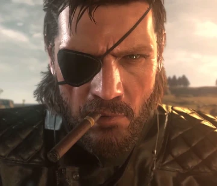

Биг Босс – легендарный солдат и прототип для проекта "Les Enfants Terribles". Этот проект создал его клонов: Солид Снейка, Ликвида Снейка и Солидуса Снейка, что сделало его генетическим "отцом" многих ключевых персонажей серии.

Его настоящее имя – Джон (иногда называемый Джеком). Он служил в вооруженных силах США и стал учеником "The Boss", легендарного солдата, который сильно повлиял на его философию и личность.

После событий Metal Gear Solid 3: Snake Eater он получил титул "Биг Босс". Этот титул был присвоен ему за выполнение сложнейшей миссии – устранение своего наставника, The Boss, и предотвращение ядерной катастрофы.

Биг Босс основал две известные частные военные организации – Militaires Sans Frontières (MSF) и Outer Heaven. Это было частью его мечты создать место, где солдаты могли бы жить свободно, без контроля правительств.

Его моральные принципы и действия часто вызывали противоречия. Несмотря на его благородные намерения освободить солдат от политических манипуляций, он не раз становился антагонистом, используя террористические методы и вызывая хаос.

